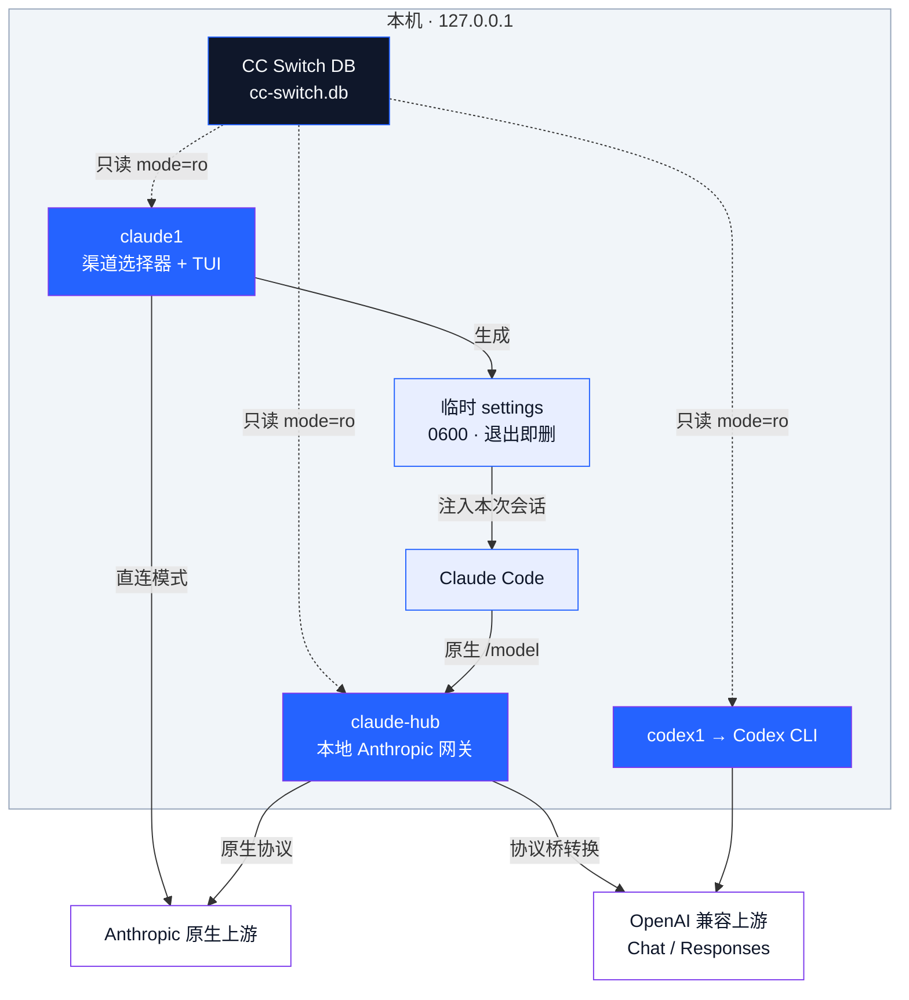

<div align="center">


# claude1

**See the route. Launch with confidence.**

为本次 Claude Code 会话选择渠道 —— 不改全局配置，不接管 `claude`，不存储任何凭证

<p>
  <a href="https://github.com/Aley3567/Agent-Hub/actions/workflows/tests.yml"></a>
  
  
</p>
<p>
  
  
  <a href="LICENSE"></a>
</p>

<a href="#quick-start"><b>快速开始</b></a> ·
<a href="#features"><b>核心能力</b></a> ·
<a href="#architecture"><b>架构</b></a> ·
<a href="#commands"><b>命令速查</b></a> ·
<a href="#hub"><b>Hub 网关</b></a> ·
<a href="#security"><b>安全边界</b></a>

<br>


</div>

---

## 这是什么 · Overview

`claude1` 是 [Claude Code](https://claude.com/product/claude-code) 的**渠道启动器**：渠道和凭证继续由
[CC Switch](https://github.com/farion1231/cc-switch) 管理，`claude1` 只为**本次会话**选择渠道。

启动一次 = 一个隔离的会话。凭证只进入这一个子进程的环境和它独享的临时 settings（权限 `0600`，
进程结束即删）；CC Switch 的全局 current provider、你的持久 `~/.claude/settings.json`、
普通 `claude` 命令，三者都不受影响。

可选的 `claude-hub` 本地网关再往前一步：**一个长会话里用原生 `/model` 直接切换渠道和模型**，
把 Fable / Opus / Sonnet / Haiku 四个原生槽位分别绑到不同渠道 —— 粗活走便宜快速的渠道，硬骨头
走强模型，长上下文走大窗口渠道。这正是 cc-switch 的单 current provider 架构做不到的事：
它是切换器，`claude-hub` 是**多模型同时在线**。

> **定位**：cc-switch 管渠道和凭证，本工具管它架构上做不到的多模型同时在线。是共生层，不是替代品。
> 完整产品边界见 [docs/product-definition.md](docs/product-definition.md)。

<a id="features"></a>

## 核心能力 · Features

| 能力 | 说明 | 边界 |
| :--- | :--- | :--- |
| **按会话隔离的渠道选择** | 凭证只注入本次 Claude Code 子进程环境与独享临时 settings（`0600`，退出即删） | 不动 CC Switch 全局 current，不改持久 settings，不接管普通 `claude` |
| **会话内切渠道 + 切模型** | 可选 `claude-hub` 网关只听 `127.0.0.1`；进入 Claude Code 后用原生 `/model` 选 `渠道别名,模型名` | 请求发生时才从 CC Switch DB 只读取凭证，网关不落盘凭证 |
| **四槽位模型路由** | Fable / Opus / Sonnet / Haiku 四个原生槽位各自绑定「渠道,模型」，每槽独立默认 effort | 手工分配；模型自动识别分槽属待建 |
| **跨 provider 故障转移** | 顶层 `routes` 声明显式故障转移组，`/model` 写 `route:<组名>` 按序尝试 | 只有「上游尚未接受请求」的安全失败才转移；`5xx`、发送后断线、已开始响应都不转移 |
| **同 provider 多账号轮换** | 账号池按 priority 分层，层内 `round-robin` 或 `weighted`；`401/403` 停用该 key，`429` 遵守上游 `Retry-After` | 池里不保存 key，只组合 CC Switch 里现有 provider 的稳定 id |
| **OpenAI 兼容上游接入** | 协议桥做 Anthropic ↔ OpenAI Chat / Responses 的 JSON / SSE 双向转换 | 转换失败或缺 uv 时明确报错，**不静默降级** |
| **用量与缓存命中率** | `claude1 usage` 输出汇总表 + Braille 双曲线，数据来自 Hub 实时埋点或历史会话导入 | 只存 token 计数、时间和稳定账号 id，不含任何凭证或对话内容 |
| **上游真实报错可见** | 非流式错误原因进下游 error 与 `x-hub-upstream-code` 头；流式错误发终态 `error` 事件而非静默断连 | 错误日志脱敏后只留 code / message / 渠道 / 状态码，**不存请求或响应 payload** |
| **Codex CLI 同样支持** | `codex1` 用影子 `CODEX_HOME` + profile 层叠为本次 Codex 会话选渠道 | 不写用户任何文件；真实 `~/.codex/*` 与 CC Switch DB 全程只读 |

设计上只有一条总规则：**协议数据默认放行，reject 只留给安全与因果**；失败绝不伪装成成功。
详见 [CLAUDE.md](CLAUDE.md)。

<a id="architecture"></a>

## 架构 · Architecture



三条不可协商的边界：

- **凭证只读**：全部凭证只从 `~/.cc-switch/cc-switch.db` 以 `mode=ro` 读取，一个字节都不写回；
  不落盘、不进日志、不进 argv。
- **只听回环**：Hub 只绑定 `127.0.0.1`，并要求配置、DB 及其 `-wal` / `-shm` 文件权限不超过 `0600`，
  否则拒绝启动。
- **失败不伪装**：断流不补 `message_stop`，工具调用丢了不伪装 `completed`。

<a id="quick-start"></a>

## 快速开始 · Quick Start

### 1 · 准备依赖

| 依赖 | 要求 | 缺失后果 |
| :--- | :--- | :--- |
| zsh | 默认 shell | 无法安装 shell 集成 |
| Python | 3.11 或更高 | 启动器无法运行 |
| Claude Code CLI | 终端中可运行 `claude` | 无法启动会话 |
| CC Switch | 至少一个 Claude provider，已生成 `~/.cc-switch/cc-switch.db` | 没有可选渠道 |
| [uv](https://docs.astral.sh/uv/) | 仅 `claude-hub` 与 OpenAI 协议桥需要 | Anthropic 原生 provider 仍可用；选到需协议转换的 provider 会**明确报错**，不会静默启动 |

### 2 · 安装

```bash
git clone https://github.com/Aley3567/Agent-Hub.git
cd Agent-Hub
./install.sh
source ~/.zshrc
```

安装器把启动器、Hub、命名 Hub 目录模块、共享协议模块、账号池调度和 statusline 模型解析器
复制到 `~/.claude`（codex1 启动器装到 `~/.codex/scripts/`），并在 `~/.zshrc` 添加一条带
`# claude1 managed source` 标记的 source 行。

- 已有目标文件和 `~/.zshrc` 在**改写前备份**；重复运行不会重复添加 source 行；
- 默认只新增 `claude1`、`claude1-direct`、`codex1` 三个 zsh 函数，**不替换普通 `claude`**；
- 安装器只检查 CC Switch 数据库是否存在且可读，**不读取也不复制**其中的配置与凭证。

### 3 · 选择渠道

```bash
claude1
```

`↑↓` 或 `j/k` 移动，`Enter` 启动；前 10 项也可用 `1–9` 和 `0` 直选。最近使用的渠道成为
默认光标，但**列表顺序和数字编号保持稳定** —— 肌肉记忆不会因为上次用了谁而错位。

<a id="commands"></a>

## 命令速查 · Commands

**日常启动**

| 命令 | 作用 |
| :--- | :--- |
| `claude1` | 打开渠道选择器 |
| `claude1 <name>` | 按 provider 名或唯一别名直达（大小写不敏感） |
| `claude1 id:<provider-id>` | 按稳定 id 直达，用于重名 provider |
| `claude1 direct` | 本次直接启动原生 Claude Code |
| `claude1 current` | 本次使用 DB `is_current` 标记的 CC Switch 当前渠道 |
| `claude1 any` | 本次使用已有的 AnyRouter settings |
| `claude1 list` | 稳定顺序列出可见渠道 |
| `CLAUDE1_NO_ANIMATION=1 claude1` | 关闭开场动画 |

**Hub 网关**

| 命令 | 作用 |
| :--- | :--- |
| `claude1 hub` | 从默认命名 Hub 的 `launch_slot` 直启 |
| `claude1 hub --slot sonnet` | 从默认命名 Hub 的指定槽位启动 |
| `claude1 hub --model lab,model` | 从默认命名 Hub 的指定渠道与模型启动 |
| `~/.claude/scripts/claude-hub.py doctor` | Hub 本机只读体检（配置 / DB / 映射 / 权限） |
| `~/.claude/scripts/claude-hub.py errors [-n N]` | 查看脱敏后的上游错误日志，默认最近 20 条 |

**账号池**

| 命令 | 作用 |
| :--- | :--- |
| `claude1 accounts list [<主provider>]` | 查看多账号池与运行状态 |
| `claude1 accounts add <主> <成员...>` | 加入账号池（首次会把主 provider 一并放进池） |
| `claude1 accounts set <主> <成员> --weight N --priority N` | 调整权重与优先级 |
| `claude1 accounts policy <主> round-robin\|weighted` | 切换调度策略 |
| `claude1 accounts reset <主> [成员]` | 清除停用 / 冷却状态 |
| `claude1 accounts remove <主> <成员>` / `delete <主>` | 移除成员 / 删除整池 |

**观测与诊断**

| 命令 | 作用 |
| :--- | :--- |
| `claude1 usage` | 最近 24 小时用量（默认） |
| `claude1 usage --day\|--week\|--month` | 24 小时按时 / 7 天按天 / 30 天按天 |
| `claude1 doctor` | 本机只读检查，**不连接 provider** |
| `claude1 doctor --fix` | 备份 DB 后清理 provider 的子代理模型固定值 |
| `claude1 --help` | 完整命令与快捷键 |

**Codex CLI**

| 命令 | 作用 |
| :--- | :--- |
| `codex1` | 打开 Codex 渠道选择器 |
| `codex1 <name>` | 按渠道名直达；**未匹配上的首个位置参数会原样成为 codex 的 prompt，并在 stderr 明确提示** |
| `codex1 --list` | 列出可用 Codex 渠道及其稳定 id |
| `codex1 [渠道] -- <codex args>` | 其余参数透传给 `codex` |

### 首页快捷键

| 按键 | 作用 |
| :--- | :--- |
| `↑↓` / `j` `k` | 移动光标 |
| `Enter` | 启动选中项（Hub 行则从其 `launch_slot` 启动） |
| `1–9` `0` | 直选前 10 项 |
| `m` | 打开模型 / effort 快捷面板（Hub 行则进入 Slots / Channels 管理页） |
| `→` / `Tab` | 进入选中 Hub 的管理页 |
| `a` / `n` | 新建空白命名 Hub 并进入首次设置 |
| `r` | 重命名 Hub（只改显示名，不动稳定 id、配置路径与运行身份） |
| `q` / `Esc` | 退出，清屏后只留一行 Bye |

开场大 Logo 只在进入时流动并呼吸，最长 `240ms`，随后停在明亮静态帧并在选择期间保持显示。
选择器**阻塞等待按键**，没有后台动画和定时唤醒。

### 模型 / effort 快捷面板

首页选中渠道后按 `m`：文本编辑模型覆盖（留空清除），`←` `→` 或 `e` 在
「未设置 → low → medium → high → xhigh」间循环 effort，`Esc` 保存关闭；`Enter` 仍然一键启动，
不被面板打断。有覆盖的行尾会显示 `模型:<模型>` 和 `effort:<级别>` 标记。

覆盖保存在 `~/.cc-switch/claude1-config.json` 的 `providers.<id>.model` /
`providers.<id>.effort`，**绝不写 CC Switch 数据库**，只影响 claude1 启动的本次会话。
生效优先级：

```text
本地覆盖  >  CC Switch env  >  Claude Code 内置默认
```

模型覆盖写入 `ANTHROPIC_MODEL`（其余 `DEFAULT_*` 槽位不动）及临时 settings 的展示模型；effort
覆盖写入临时 settings 的 `effortLevel`，与 Hub 槽位走同一字段。未设 effort 的普通 provider 默认
`high`，不会继承 CC Switch 当前 provider 的全局模型、`[1M]` 标记或 effort。

<a id="security"></a>

## 安全与隔离边界 · Security & Isolation

默认启动只影响本次 Claude Code 会话：

- 不切换 CC Switch 的全局 current provider；
- 不接管普通 `claude`；
- provider 凭证只进入本次 Claude Code 子进程环境及其独享的临时 settings；临时 settings
  权限 `0600`，用于覆盖 CC Switch 的全局 current 配置，进程结束后立即删除；
- resume 会话的路由身份只保存在 `~/.cc-switch/claude1-session-routes.json` 的脱敏元数据中
  （session ID、provider 标识、协议和模型，权限 `0600`，最多保留 256 条），不写入凭证、URL
  或请求内容；
- Hub 以只读方式从 CC Switch DB 获取上游地址和凭证，配置示例中不保存上游 token。

`claude1 current` 与 statusline 的 CC Switch 回退都以数据库中**唯一**的
`providers.is_current=1` 为准；`~/.cc-switch/settings.json` 只视为缓存，不再作为启动器的
当前 provider 真相源。零个或多个 current 标记会 **fail closed**。

提交和推送前建议先启用凭证、私有渠道名和本机配置拦截：

```bash
./scripts/install-git-guards.sh
```

### 可选：让普通 `claude` 也走选定后端

`scripts/zsh-sticky-integration.sh` 是**显式 opt-in** 功能，默认安装器不会复制或 source 它。
需要让 `claude1 use <backend>` 改变普通 `claude` 的后续路由时：

```bash
./install.sh --enable-sticky
source ~/.zshrc
claude1 use hub
```

未启用时，`claude1 use` 只保存选择并明确提示普通 `claude` 尚未接管，不再输出已经生效的
误导性承诺。已启用的集成可随时撤销，且不会改动你自行添加的 shell 配置：

```bash
./install.sh --disable-sticky
source ~/.zshrc
```

## 可选：同一 provider 使用多个账号 / key · Account Pools

账号池适合「同一个上游、多个账号各有独立额度」的情况。每个 key 仍先在 CC Switch 中建立为一个
独立 Claude provider；`claude1` 只把这些现有 provider 的**稳定 id** 组成逻辑池，不接收 key，
也不会把 key 复制到自己的配置或状态库。

下面以唯一 provider 名为例；有重名时改用 `id:<provider-id>`：

```bash
claude1 accounts add "主账号" "第二账号"
claude1 accounts add "主账号" "备用账号" --priority 10
claude1 accounts set "主账号" "主账号" --weight 2 --priority 0
claude1 accounts set "主账号" "第二账号" --weight 3 --priority 0
claude1 accounts policy "主账号" weighted
claude1 accounts list "主账号"
```

第一次 `add` 会自动把主 provider 本身和新增账号一起放进池。调度先选择数值**最小**的
`priority`；同一优先级内，`round-robin` 等量轮换，`weighted` 按 `weight` 长期比例轮换。
因此相同 priority 适合额度分摊，更大的 priority 适合备用账号。`weighted` 使用确定性的连续
权重槽，较大的 weight 可能连续命中同一账号；希望请求分布更平滑时优先用默认的 `round-robin`
或较小权重。

运行时规则刻意保持保守：

| 情况 | 行为 |
| :--- | :--- |
| `401` / `403` | 停用该 key，直到 CC Switch 中的 key 发生变化，或手动 `claude1 accounts reset` |
| `429` | 优先遵守上游 `Retry-After`；缺失或无效时默认冷却 60 秒，最长 3600 秒 |
| 连接错误 / `5xx` / 已开始的 SSE | **不重放、不换号**，避免重复提交或重复计费 |
| Anthropic 原生直连 | 会话启动时选一次账号，整个会话固定；无法中途观察 `429` 自动切换 |
| 成员配置不一致 | 上游 URL、模型、协议、proxy 始终由主 provider 决定，成员只贡献 credential；必须同上游 URL 与同凭证类型，尾部 `/v1` 统一归一化，重复 key 在 CLI 和运行时都被拒绝 |

账号池**不修改** CC Switch 的 `is_current`，因此控制面互不抢占；它也**不建立**跨应用的独占
lease。多个 native 会话、多个 Hub 进程或 CC Switch 自己启动的会话仍可能同时使用同一个 key ——
账号池提供的是轮换和故障隔离，**不是额度锁或全局并发配额**。

任一启用成员在 CC Switch 中缺失、凭证为空或 endpoint 不兼容时，池会 fail closed，避免静默把
key 发往错误上游。若成员已先从 CC Switch 删除，可用其原始稳定 id 清理：

```bash
claude1 accounts remove id:<主provider-id> id:<已删除成员-id>
```

非敏感规则默认写入 `~/.cc-switch/claude1-account-pools.json`，共享 cursor、冷却、停用状态和
credential 指纹写入 `~/.cc-switch/claude1-account-state.sqlite3`；**两者都不保存 key**。
完整字段见 [`examples/claude1-account-pools.example.json`](examples/claude1-account-pools.example.json)。

<a id="hub"></a>

## 可选：启用 claude-hub 网关 · Hub Gateway

Hub 适合需要在不同工作区、或一个长会话里频繁切换渠道和模型的人。每个**命名 Hub** 都有独立的
v2 配置、端口、进程、日志和用量记录；它们都只监听本机 `127.0.0.1`，Claude Code 仍使用原生
`/model` 选择器。

### 首页与管理页

启动首页只列命名 Hub，不展开模型或四个槽位：

- `↑↓` 选择 Hub，`Enter` 直接从该 Hub 的 `launch_slot` 启动；
- `m`、`→` 或 `Tab` 进入该 Hub 的 Slots / Channels 管理页；
- `a` 或 `n` 创建一个**不继承任何渠道或模型**的空白 Hub，并立即进入首次设置页，为 Fable、
  Opus、Sonnet、Haiku 逐槽选择「渠道,模型」映射。四槽完成前首页显示「待配置」，`Enter`、`m`
  或 `→` 只会继续设置，**不会启动**；
- `r` 只修改显示名，不改变稳定 id、配置路径或运行身份。

Channels 页新增渠道走「渠道 → 模型 → 设置 → 确认」四阶段面板。选择 CC Switch 渠道后，该渠道
声明的模型默认全部勾选，可用空格取消或重新勾选；候选列表没有目标模型时选「手动添加模型 ID」。
确认后**只新增当前 Hub 的渠道**，不会替换四个原生槽位 —— 槽位绑定统一在 Slots 页完成。

### 配置步骤

**1 · 安装 uv**（见上方依赖表）。

**2 · 从仓库复制示例配置**，把 provider 名改成 CC Switch 中的真实名称：

```bash
cp examples/claude-hub.example.json ~/.cc-switch/claude-hub.json
chmod 600 ~/.cc-switch/claude-hub.json ~/.cc-switch/cc-switch.db
${EDITOR:-vi} ~/.cc-switch/claude-hub.json
```

配置里几个键的分工容易混，分清楚：

| 键 | 负责什么 | 不负责什么 |
| :--- | :--- | :--- |
| `model_slots` | 把 Fable / Opus / Sonnet / Haiku 四个原生槽位绑定到已声明的「渠道,模型」 | — |
| `launch_slot` | 默认直启用哪个槽位 | 不影响裸模型请求的路由 |
| `effort_by_slot` | 每个槽位各自的默认 effort | — |
| `default_channel` | **仅**裸模型请求的网关回退路由 | **不等同于启动默认值** |
| `routes` | 跨 provider 的显式故障转移组 | 不做隐式兜底 |

顶层 `routes` 声明的故障转移组：把 `/model` 的模型名写成 `route:<组名>`，Hub 按组内 target
顺序尝试，每个 target 沿用各自的账号池与 transport 策略。**只有「上游尚未接受请求」的安全失败
才会进入下一 target** —— 当前 target 的所有账号与 transport 都以 `401/403` 拒绝，或收到 `429`；
`5xx`、发送后断线、已开始向下游响应都不会转移。每个 target 必须引用已声明的「渠道,模型」
（模型 ID 不在 provider 之间盲传），可选用 `requires` 列出最低协议能力，启动时逐 target 校验。
响应头 `x-hub-route` 标明命中的组名。

首次打开 `claude1` 时，启动器会把现有 `~/.cc-switch/claude-hub.json` 自动登记为名为
`Claude-Hub` 的工作区，并创建目录 `~/.cc-switch/claude-hubs.json`。**旧配置文件只被目录引用，
不会被移动或改名。** 新建 Hub 先把不含模型的设置草稿写入 `~/.cc-switch/hubs/<hub-id>.setup.json`；
四槽映射确认完成后才原子生成独立的 `~/.cc-switch/hubs/<hub-id>.json`，并分配端口与运行身份。

目录文件结构如下，其中所有路径都相对于目录文件所在位置：

```json
{
  "version": 1,
  "default_hub": "claude-hub",
  "order": ["claude-hub"],
  "hubs": {
    "claude-hub": {
      "name": "Claude-Hub",
      "state": "ready",
      "config": "claude-hub.json",
      "log": "logs/claude-hub.log",
      "usage": "logs/claude-hub-usage.jsonl"
    }
  }
}
```

channel 的 `provider` 建议写成 `id:<provider-id>`；Channels 添加向导会始终保存稳定 id，
**不保存凭证**。向导优先复用 CC Switch 的协议元数据；无法判断时会要求你选择 Anthropic、
OpenAI Chat 或 OpenAI Responses，**避免静默使用错误协议**。每个旧版 Hub 配置首次打开时都会
原子迁移到 v2，并在其原目录留下一份 `<配置文件名>.bak-migrate-*` 私有备份。

**3 · 生成本机专用 token 并启动。** Hub 持续运行期间应复用同一个 token：

```bash
umask 077
[[ -s ~/.cc-switch/claude-hub-token ]] || \
  python3 -c 'import secrets; print(secrets.token_urlsafe(32))' \
    > ~/.cc-switch/claude-hub-token
export CLAUDE_HUB_LOCAL_TOKEN="$(< ~/.cc-switch/claude-hub-token)"
~/.claude/scripts/claude-hub.py doctor
claude1 hub
```

`doctor` 默认只检查本机配置、数据库、渠道映射和文件权限，**不连接 provider**，也不显示上游
地址或 token。Hub 要求配置、CC Switch 数据库以及当前存在的 `-wal`、`-shm` 文件权限不超过
`0600`；检查失败时按输出修正后再启动。

### 进入会话后

运行 `/model`，模型以 `渠道别名,模型名` 的形式出现。Slots 页可修改各槽位的默认 effort，并用
`b` 把模型池里的模型绑定到某个槽位；Channels 页可添加或删除**未被回退路由和槽位引用**的渠道。
槽位默认 effort 通过本次会话的临时 settings 注入，不会用环境变量锁死，进入会话后仍可用原生
`/effort` 调整。Hub 在请求发生时才从 CC Switch DB 只读获取对应 provider 的凭证，不修改 DB、
provider 或 current 状态。

## 可选：为 Codex CLI 选渠道（codex1）· Codex CLI

`codex1` 是同一套思路在 [Codex CLI](https://developers.openai.com/codex/cli/) 上的落地：启动前
选一个 CC Switch 的 codex 渠道，本次会话生效。它**不是** Hub —— 没有本地网关、协议转换、账号池、
成本护栏和 failover，要的只是「随时选一个喜欢的渠道随开随用」。

```bash
codex1                # 打开渠道选择器（最近使用优先）
codex1 mimo           # 按渠道名直达
codex1 --list         # 列出可用渠道及稳定 id
```

cc-switch 切 codex 渠道是**整体重建** `~/.codex/config.toml` 和 `auth.json` —— 那对「切换」是对的，
对「临时用一次」是灾难：全局有状态，两个终端不能各用各的渠道，退出还得记得切回来。`codex1` 改用
三段机制，一个字节都不写你的文件：

| 机制 | 做法 |
| :--- | :--- |
| **影子 `CODEX_HOME`** | `mkdtemp(mode 0700)`，把真实 `~/.codex` 下所有条目 symlink 进去；sessions / history / 日志照常写真实目录，退出时整个 `rmtree` |
| **profile 层叠** | `config.toml` 仍 symlink 到真实文件，你的 mcp_servers / agents / tui / features 原样继承；渠道差异只写进影子里的 `codex1.config.toml`，靠 codex 原生的 `codex -p codex1` 层叠。**不自己 merge TOML** |
| **段重命名 + 影子认证** | 把渠道 config 里 `model_provider` 指向的段重命名为 `[model_providers.codex1]`，profile 顶层写 `model_provider = "codex1"`；API key 类写入一次性影子 `auth.json`，避免 Ghostty/不同 Codex 构建因不识别 `env_key` 跳到登录页 |

两个刻意的 fail-fast：codex 对**不存在的 profile 名不报错**，会静默回落到基础 config —— 你以为切了
渠道，其实账单和数据都去了别处，所以启动前断言影子里的 `codex1.config.toml` 存在且可读；同理，
渠道 config 里 `model_provider` 指向的段缺失时**拒绝启动**，绝不兜底成默认渠道。

完整设计与已知取舍见 [docs/codex1-design.md](docs/codex1-design.md)。

## 可选：查看 token 用量与缓存命中率 · Usage

请求经过 Hub 时，网关把每条响应的 token 用量（输入 / 输出 / 缓存读 / 缓存写）追加到
`~/.cc-switch/logs/claude-hub-usage.jsonl`（权限 `0600`，只存 token 计数、时间和稳定账号 id，
**不含任何凭证**）。账号池请求的响应头 `x-hub-account` 和 JSONL 的 `account` 字段可用于定位
实际使用的账号；当前 `claude1 usage` 图表按全部账号汇总。命名 Hub 各自写自己的用量文件。

```bash
claude1 usage            # 最近 24 小时（默认）
claude1 usage --day      # 最近 24 小时，按小时分桶
claude1 usage --week     # 最近 7 天，按天分桶
claude1 usage --month    # 最近 30 天，按天分桶
```

输出分两部分：

- **汇总表**：请求数、输入 / 输出 / 缓存读 / 缓存写 token，以及整体缓存命中率
  （`缓存读 / (输入 + 缓存读)`）；
- **Braille 双曲线**：缓存命中率与 token 量（按窗口内峰值归一化）随时间的变化；彩色终端用两种
  颜色区分，禁用颜色时共用 Braille 点阵并保留文字图例。

两点必须先知道，否则会误读数字：

- 只有返回了 cache 字段的上游（官方 / 原生 Anthropic 转发）缓存命中率才是真实值。多数 OpenAI
  兼容中转**不返回 cache 字段**，对应渠道的缓存读会计为 `0`，命中率因此偏低属正常；
- 用量文件由 Hub 写入。首次使用或窗口内无记录时，`claude1 usage` 会提示先用 `claude1 hub`
  跑几个请求。

### 导入已有会话的用量

除了 Hub 实时埋点，也可以把 Claude Code 本地会话记录（`~/.claude/projects/*/*.jsonl`）里已经
发生的用量一次性导入同一个统计文件，这样能覆盖不经过 Hub 的直连渠道。导入按消息 id 去重，
时间戳取消息本身的时间：

```bash
python3 - <<'EOF'
import json, glob, os, time, datetime
start = time.mktime(datetime.date.today().timetuple())  # 今天 00:00
seen = {}
for path in glob.glob(os.path.expanduser("~/.claude/projects/*/*.jsonl")):
    for line in open(path, encoding="utf-8", errors="ignore"):
        try: r = json.loads(line)
        except Exception: continue
        m = r.get("message")
        if not (isinstance(m, dict) and isinstance(m.get("usage"), dict)): continue
        ts = datetime.datetime.fromisoformat(
            (r.get("timestamp") or "").replace("Z", "+00:00")).timestamp()
        if ts < start: continue
        u = m["usage"]
        seen[m.get("id")] = (ts, u, m.get("model", ""))
out = os.path.expanduser("~/.cc-switch/logs/claude-hub-usage.jsonl")
with open(out, "a", encoding="utf-8") as f:   # 追加；想重来先清空该文件
    for ts, u, model in sorted(seen.values()):
        f.write(json.dumps({"ts": int(ts), "channel": "import",
            "model": model, "format": "session",
            "in": u.get("input_tokens", 0), "out": u.get("output_tokens", 0),
            "cr": u.get("cache_read_input_tokens", 0),
            "cw": u.get("cache_creation_input_tokens", 0)}) + "\n")
os.chmod(out, 0o600)
print("导入", len(seen), "条")
EOF
```

## 可选：查看上游真实报错原因 · Error Journal

渠道出问题时，客户端往往只看到一个干巴巴的 `400` 或响应中途断开，而上游其实说清了原因
（例如「5 小时限额已用完」「用户额度不足」）。Hub 把这类原因在两个地方保留下来：

| 时机 | 保留方式 |
| :--- | :--- |
| **实时** | 非流式错误的原因写进下游 error 消息与 `x-hub-upstream-code` 响应头；流式错误改为发一个终态 `error` 事件而不是静默断连；路由耗尽的报错会点名最后一个目标的真实原因 |
| **事后** | 追加一行到 `~/.cc-switch/logs/claude-hub-errors.jsonl`（`0600`，单份轮转，只存脱敏后的 code / message 与渠道、模型、状态码，**不存任何请求或响应 payload**）；命名 Hub 各自写 `<hub>-errors.jsonl` |

```bash
~/.claude/scripts/claude-hub.py errors          # 最近 20 条
~/.claude/scripts/claude-hub.py errors -n 100   # 最近 100 条
```

输出每行是「时间 / 阶段（`response` · `stream` · `route`）/ 渠道·模型 / 状态码 / code / 原因」。
转发路径上的任何 journal 写入失败都被静默吞掉，**不会影响请求本身**。

消息在写入和转发前都会过一遍脱敏：`Bearer` / `Basic` token、URL、`token=` / `api_key:` /
`cookie=` / `session=` 这类赋值形状、明确 header 语境中的 opaque value、JWT，以及 `sk-` /
`rk-` / `pk-` 前缀的 key 一律替换为占位符；message 最多保留 512 个 **Unicode 字符**
（不是 UTF-8 字节数）。中文原因不受影响。

## 可选：在自定义 statusline 中显示实际上游模型 · Statusline

安装器会复制一个**不接管布局**的模型解析器：`~/.claude/scripts/statusline-model.py`。它读取
Claude Code 传给 statusLine 命令的同一个 JSON，只输出实际模型名，已有 statusline 可以直接复用：

```bash
input=$(cat)
model=$(printf '%s' "$input" | ~/.claude/scripts/statusline-model.py)
```

解析器对普通 Claude 进程优先使用最新 assistant 响应模型，并忽略回合末的 attachment、工具结果、mode、
permission-mode、last-prompt、file-history 和 system 统计元条目；对 `claude1` 进程则优先显示本次
启动器选择的 live route，避免恢复旧 session 时把历史模型误显示成当前路由。回退时按 stdin `.model.id`
与各 slot 的实际值**精确比对**，不靠 `opus` / `sonnet` / `haiku` 关键词猜测。通过 CC Switch
本地代理时，slot 映射只读取唯一的 DB current provider。

## 安装位置与备份 · Install Layout

```text
~/.claude/
├── scripts/
│   ├── claude-provider-once.py     # 启动器
│   ├── claude-hub.py               # 本地网关
│   ├── claude_hub_catalog.py       # 命名 Hub 目录
│   ├── claude1_account_pool.py     # 账号池调度
│   ├── claude1_protocol.py         # 协议兼容入口
│   ├── claude1_protocol_types.py   # 协议类型与错误
│   ├── claude1_protocol_usage.py   # usage / cache 归一化
│   ├── claude1_transport.py        # transport 策略
│   ├── claude1_usage_report.py     # 用量报表与图表
│   └── statusline-model.py         # statusline 模型解析
├── claude1/
│   └── zsh-functions.sh            # claude1 / claude1-direct / codex1
└── backups/
    └── <时间>-<进程号>/             # 改写前的原文件

~/.codex/
└── scripts/
    └── codex-provider-once.py      # codex1 启动器
```

隔离测试或自定义安装位置时可以显式注入目录：

```bash
HOME=/tmp/claude1-home \
CLAUDE1_INSTALL_ROOT=/tmp/claude1-install \
CODEX1_INSTALL_ROOT=/tmp/codex1-install \
./install.sh
```

安装器始终从 `$HOME/.cc-switch/cc-switch.db` 检查 CC Switch 是否已经就绪。

## 项目结构 · Project Layout

| 路径 | 作用 |
| :--- | :--- |
| `claude-provider-once.py` | 一次性 provider 选择、TUI 与 Claude Code 启动 |
| `claude-hub.py` | 可选的本地 Anthropic gateway |
| `codex-provider-once.py` | codex1：影子 `CODEX_HOME` + profile 层叠的 Codex 渠道启动 |
| `claude_hub_catalog.py` | 命名 Hub 目录、路径与迁移规则 |
| `claude1_account_pool.py` | 多账号选择、冷却、停用状态与非敏感配置写入 |
| `claude1_protocol.py` | 协议兼容入口，以及 request / response / stream 编排 |
| `claude1_protocol_types.py` | 协议错误、转换计划和共享 IR 类型 |
| `claude1_protocol_usage.py` | usage counter、cache usage 和回执归一化 |
| `claude1_transport.py` | 上游 transport policy、代理选择与请求边界 |
| `claude1_usage_report.py` | Hub usage 日志读取、汇总和终端图表 |
| `statusline-model.py` | 自定义 statusline 可复用的实际上游模型解析 |
| `scripts/zsh-functions.sh` | 默认安全的 `claude1` / `codex1` shell 集成 |
| `scripts/zsh-sticky-integration.sh` | 需要人工接入的普通 `claude` 粘性路由 |
| `scripts/install-git-guards.sh` | 安装凭证与私有信息的提交 / 推送拦截钩子 |
| `scripts/secret_guard.py` | 凭证与敏感路径扫描（`prepublishOnly` 与 CI 都调用） |
| `scripts/probe.sh` · `watchd.sh` · `observe-claude1.sh` · `alert.sh` | probe / watch / 观测 / 告警辅助脚本 |
| `bin/model-bridge.js` | npm 包 `@yufeng-dev/model-bridge` 的启动器 shim |
| `assets/brand/agent-hub/mark.svg` | 品牌标识 |
| `examples/claude-hub.example.json` | 无凭证 Hub 配置示例 |
| `examples/claude1-account-pools.example.json` | 无凭证账号池规则示例 |
| `install.sh` | 幂等安装与改写前备份 |
| `tests/` | launcher、Hub、协议、transport、shell 与安装器的隔离测试 |

## 开发验证 · Development

```bash
python3 -m pip install "aiohttp>=3.9"
./scripts/install-git-guards.sh
python3 -m unittest discover -s tests -p "test_*.py" -v
./tests/test_shell_integration.zsh
./tests/test_install.zsh
```

测试使用临时目录、fixture DB、fake Claude 和 fake upstream，**不需要访问真实 provider**。
CI 在 `ubuntu-latest` 与 `macos-latest` 上跑 Python 3.11 / 3.12，并额外执行语法检查、
凭证扫描与 shell 集成测试。

改协议层必须同步补测试 —— 这条是硬约束，见 [CLAUDE.md](CLAUDE.md)。

## 文档 · Docs

| 文档 | 内容 |
| :--- | :--- |
| [CLAUDE.md](CLAUDE.md) | 协议宽容度总规则、fail-closed 边界与硬约束 |
| [docs/product-definition.md](docs/product-definition.md) | 产品边界、现状 / 待建清单与验收合同 |
| [docs/维护与兼容指南.md](docs/维护与兼容指南.md) | 架构、常改文件、兼容层入口与安全发布流程 |
| [docs/codex1-design.md](docs/codex1-design.md) | codex1 渠道启动器设计与已知取舍 |
| [docs/anthropic-protocol-implementation-status.md](docs/anthropic-protocol-implementation-status.md) | 协议能力矩阵与 disposition registry |
| [docs/transport-routing-design.md](docs/transport-routing-design.md) | transport 路由设计（已落地） |
| [docs/claude1-protocol-baseline-2026-08-16.md](docs/claude1-protocol-baseline-2026-08-16.md) | 协议层基线与薄弱点 |
| [docs/publishing.md](docs/publishing.md) | npm 发布 runbook 与发布前验证 |

## 路线图 · Roadmap

已在路上、但**尚未发布**的部分（不把待建写成现状）：

- **韧性**：错误分类重试、首字节 / 静默超时分级、常驻 Hub 熔断器、能力画像驱动的 failover；
- **成本护栏**：花费预估、高价渠道确认、预算熔断、阈值提醒；
- **观测**：错误的「人话翻译 + 建议动作」层；模型自动识别分槽；
- **桌面端**：Tauri v2 + React 的官方桌面壳 —— 核心永远 headless，桌面端只是遥控器；
- **平台**：Windows 适配、安装 / 迁移向导、渠道白名单（合规场景）。

## License

[MIT](LICENSE) © model-bridge contributors

<div align="center">
<br>

<br><br>
<sub><b>See the route. Launch with confidence.</b></sub>
</div>
